# 🚍 Wasla – Smart Microbus Station System

<p align="center">
  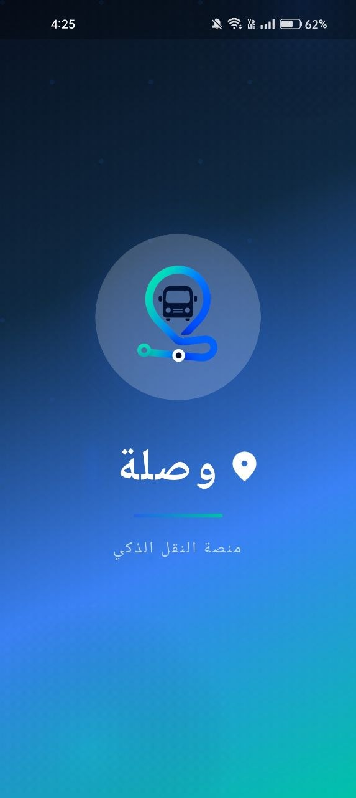
</p>

<p align="center">
A Smart Transportation Platform Built with Flutter
</p>

<p align="center">


</p>

---

# 📖 About The Project

**Wasla** is the official mobile application of the **Smart Microbus Station System**, a graduation project developed to modernize public transportation through digital technologies.

The system addresses common transportation challenges such as:

- Long passenger waiting times.
- Lack of real-time vehicle information.
- Unorganized driver queues.
- Difficulty finding routes.
- Manual station operations.

Wasla transforms these processes into a fully digital platform by providing intelligent route search, live microbus tracking, digital queue management, QR-based station operations, and real-time communication between passengers, drivers, and station staff.

The mobile application is built with **Flutter** following **Clean Architecture** principles and uses **SignalR** for real-time communication and **REST APIs** powered by ASP.NET Core.

---

# ✨ Key Features

## 👤 Passenger Application

- Secure Authentication
- Route Search
- Route Details
- Live Vehicle Tracking
- Nearby Stations
- Favorite Routes
- Driver Reporting
- Profile Management
- Arabic & English Languages
- Light & Dark Theme

---

## 🚌 Driver Application

- Driver Dashboard
- Live Queue Position
- Daily Earnings
- Trip History
- Start Trip
- End Trip
- Real-time Queue Updates
- Live Location Sharing

---

## 🏢 Station Staff Application

- QR Code Scanner
- Vehicle Check-in
- Vehicle Check-out
- Queue Management
- Instant Verification

---

# 📱 Application Preview

## Splash Screen

<p align="center">

</p>

## Passenger Module

| Home                           | Search                           | Route Details                     |
| ------------------------------ | -------------------------------- | --------------------------------- |
| 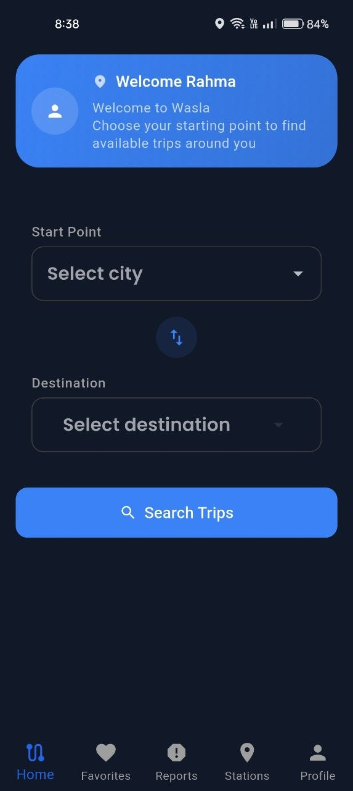 | 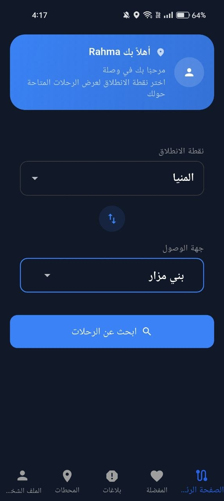 | 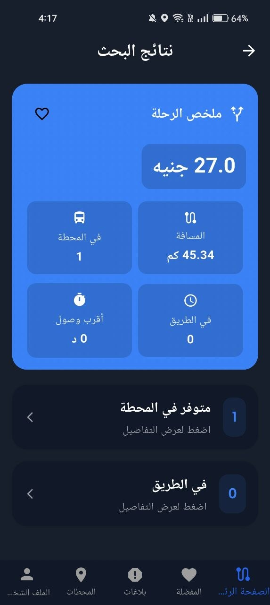 |

| Tracking                           | Reports                           | Favorites                           |
| ---------------------------------- | --------------------------------- | ----------------------------------- |
| 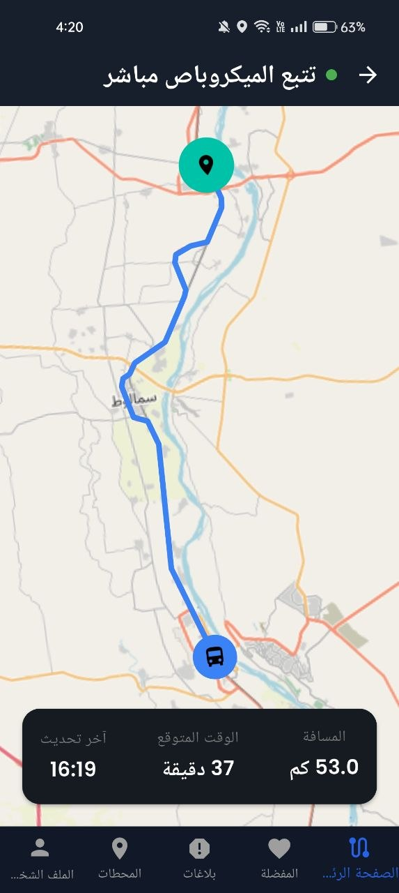 | 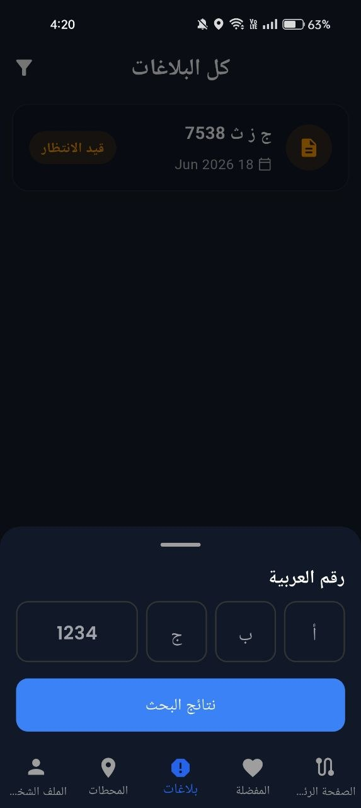 |  |

| Stations                      | Profile                           |
| ----------------------------- | --------------------------------- |
| 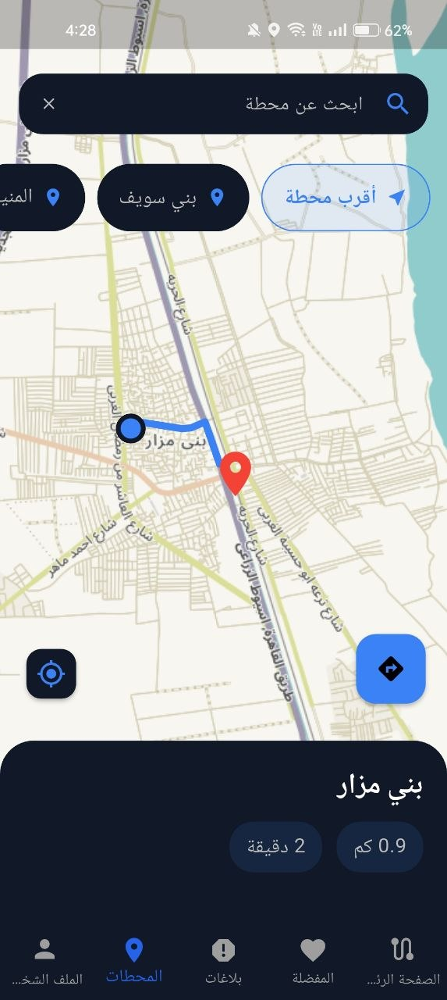 | 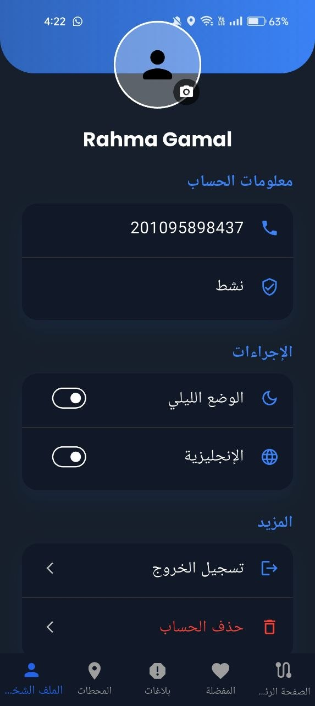 |

---

## Driver Module

| Dashboard                             | Queue                                  |
| ------------------------------------- | -------------------------------------- |
| 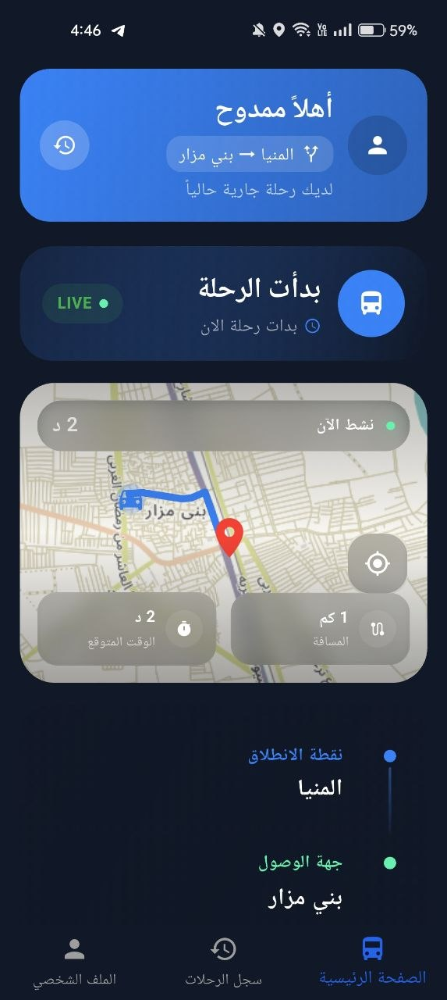 | 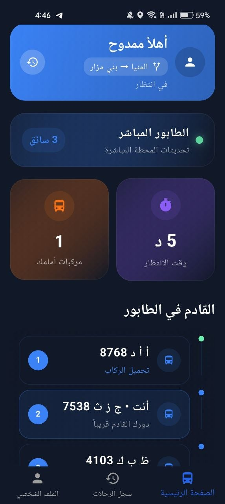 |

---

## Staff Module

| QR Scanner                   |
| ---------------------------- |
| 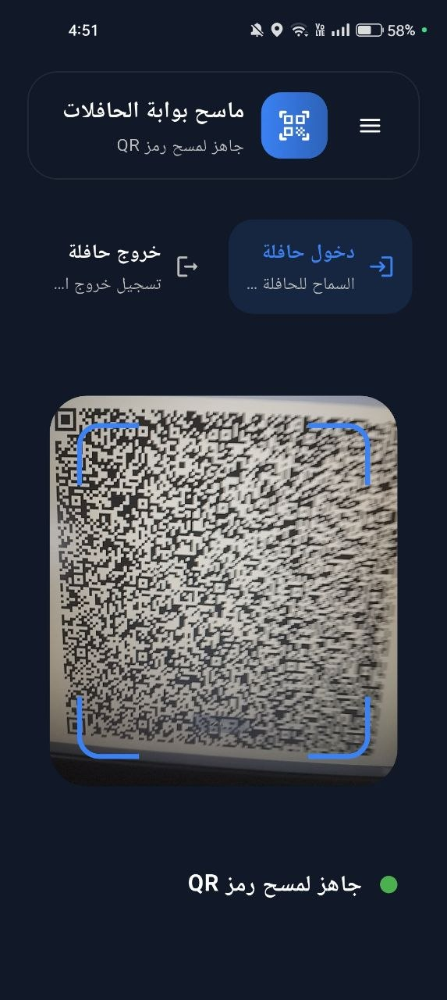 |

---

# 🏛 System Architecture

The application follows **Clean Architecture** with Feature-First organization.

```text
Presentation Layer
        │
        ▼
 Cubits / BLoC
        │
        ▼
   Use Cases
        │
        ▼
Repositories
        │
        ▼
Remote Data Sources
        │
        ▼
REST APIs + SignalR
```

The architecture ensures:

- Scalability
- Maintainability
- Testability
- Separation of Concerns
- Easy Feature Expansion

---

# 📂 Project Structure

```text
lib
│
├── app
│   ├── localization
│   └── theme
│
├── core
│   ├── auth
│   ├── config
│   ├── dependency_injection
│   ├── errors
│   ├── helpers
│   ├── networking
│   ├── routing
│   ├── services
│   ├── storage
│   └── widgets
│
├── features
│   ├── auth
│   ├── register
│   ├── passenger
│   ├── driver
│   ├── maps
│   ├── profile
│   ├── staff_qr
│   ├── onboarding
│   └── splash
│
├── l10n
│
├── my_app.dart
│
└── main.dart
```

---

# 🛠 Tech Stack

| Category             | Technology                  |
| -------------------- | --------------------------- |
| Framework            | Flutter                     |
| Language             | Dart                        |
| Architecture         | Clean Architecture          |
| State Management     | Flutter Bloc / Cubit        |
| Dependency Injection | get_it                      |
| Networking           | Dio + Retrofit              |
| Local Storage        | SharedPreferences           |
| Maps                 | Flutter Map                 |
| Location             | Geolocator                  |
| Real-time            | SignalR                     |
| QR Scanner           | Mobile Scanner              |
| Localization         | Flutter Localization        |
| Notifications        | Flutter Local Notifications |
| Code Generation      | Build Runner                |

---

# 📦 Main Packages

| Package                     | Purpose                 |
| --------------------------- | ----------------------- |
| flutter_bloc                | State Management        |
| dio                         | HTTP Client             |
| retrofit                    | API Generation          |
| get_it                      | Dependency Injection    |
| dartz                       | Functional Programming  |
| equatable                   | Value Equality          |
| shared_preferences          | Local Storage           |
| signalr_netcore             | Real-time Communication |
| flutter_map                 | Interactive Maps        |
| geolocator                  | GPS Location            |
| mobile_scanner              | QR Scanner              |
| flutter_local_notifications | Local Notifications     |
| cached_network_image        | Image Caching           |
| image_picker                | Profile Images          |
| image_cropper               | Image Cropping          |
| intl                        | Localization            |
| flutter_screenutil          | Responsive UI           |
| google_fonts                | Typography              |
| shimmer                     | Loading Effects         |
| pretty_dio_logger           | API Logs                |

---

# 🌐 Networking

The application communicates with the backend using **REST APIs** implemented in ASP.NET Core.

### Features

- Authentication APIs
- Passenger APIs
- Driver APIs
- Staff APIs
- Maps APIs
- Reports APIs
- Profile APIs

Networking is implemented using:

- Dio
- Retrofit
- Authentication Interceptor
- Automatic Token Refresh
- Error Handling
- Pretty Dio Logger

---

# 🔐 Authentication

The application provides a complete authentication system including:

- Login
- Register
- OTP Verification
- Forgot Password
- Reset Password
- Logout
- Guest Mode
- Automatic Login
- Refresh Token

Session information is securely stored using **SharedPreferences**.

---

# 📡 Real-Time Communication

Wasla uses **SignalR** to provide instant updates without refreshing the application.

Real-time Features:

- Driver Queue Updates
- Live Driver Location
- Live Vehicle Tracking
- Dashboard Updates
- Passenger Tracking

This allows passengers and drivers to receive updates immediately.

---

# 🗺 Maps & Navigation

Maps are implemented using **Flutter Map**.

Capabilities include:

- Current User Location
- Nearest Station
- Route Between Stations
- Driver Location
- Passenger Tracking
- Live Route Drawing

Location services are powered by **Geolocator**.

---

# 🌍 Localization

Supported Languages

- 🇺🇸 English
- 🇪🇬 Arabic

Features

- Runtime Language Switching
- RTL Support
- Localized Messages
- Persistent Language Selection

Localization files are generated using Flutter's localization system.

---

# 🎨 Theme

The application supports

- ☀️ Light Mode
- 🌙 Dark Mode
- 📱 System Theme

The selected theme is stored locally and restored automatically.

---

# 🔔 Notifications

The application supports Local Notifications for:

- Queue Updates
- Trip Events
- Important Alerts
- Driver Notifications

Notifications are initialized during application startup.

---

# 💾 Local Storage

The following data is stored locally:

- Access Token
- Refresh Token
- User Information
- Theme
- Language
- Guest Session
- Onboarding Status

SharedPreferences is used as the local persistence layer.

---

# 🚀 Getting Started

## Clone Repository

```bash
git clone https://github.com/a7medhosny/smart-microbus
```

## Install Packages

```bash
flutter pub get
```

## Generate Models

```bash
dart run build_runner build --delete-conflicting-outputs
```

## Generate Localization

```bash
flutter gen-l10n
```

## Run Project

```bash
flutter run
```

---

# 🧪 Code Quality

The project follows modern Flutter best practices.

✔ Clean Architecture

✔ SOLID Principles

✔ Repository Pattern

✔ Dependency Injection

✔ Cubit State Management

✔ Feature First Structure

✔ Reusable Widgets

✔ Responsive Design

✔ Separation of Concerns

✔ Null Safety

---

# 🔮 Future Improvements

- Push Notifications
- Offline Support
- Payment Gateway
- AI-based ETA Prediction
- Driver Rating System
- Admin Dashboard Enhancements
- Performance Analytics
- Unit Testing
- Widget Testing
- CI/CD Pipeline

---

# 👨‍💻 Contributors

| Name            | Role               |
| --------------- | ------------------ |
| Ahmed Hosney    | Flutter Developer  |
| Rahma Gamal     | Flutter Developer  |
| Ahmed Salah     | Backend Developer  |
| Ibrahim Hassan  | Backend Developer  |
| Mostafa Mohamed | Frontend Developer |
| Amira Ashour    | Backend Developer  |

---

# 📄 License

This project was developed as a Graduation Project for educational purposes.

Unauthorized commercial use is prohibited without permission from the project authors.

---

# Acknowledgment

Special thanks to our supervisors, instructors, and everyone who contributed to the development of the **Smart Microbus Station System**.

We hope this project contributes to improving public transportation through technology.

---

<p align="center">

Made with using Flutter

**Wasla — Smart Microbus Station System**

</p>
